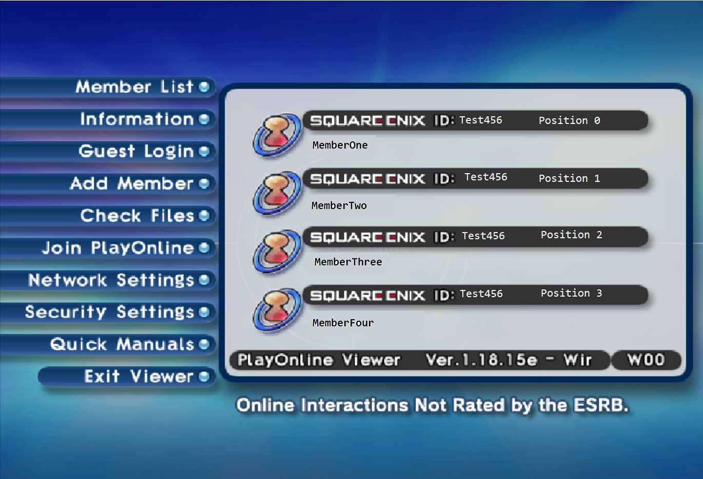
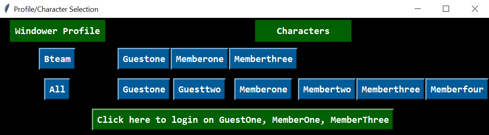
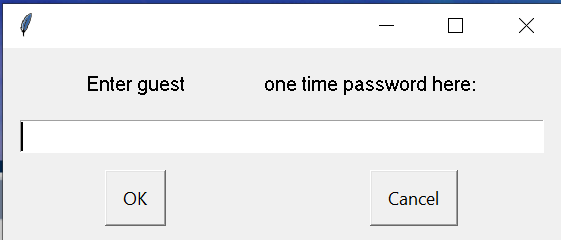

# Login Assist for FFXI

This is a python3 project intended to at least partially automate the tedious login process of final fantasy xi's playonline login system.

This is primarily accomplished with the PyAutoGUI library. This library can programmatically: move and resize windows, move and click your mouse, and type using your keyboard. Using this program requires leaving PyAutoGUI to do these things for minutes at a time with no input from you, with the exception of you having to enter one time passwords (if enabled). The failsafes that let you exit this loop in case things go wrong can also be quite irritating. If you are not comfortable with that I do not recommend using this program. For those interested, links to the source code and documentation of PyAutoGUI are listed below:

-   [Documentation](https://pyautogui.readthedocs.org)
-   [Source Code](https://github.com/asweigart/pyautogui)

This program also requires you to have your account information in a local xml file which is used to enter in your login data. If you are not comfortable with that I do not recommend using this program.

I recommend going to the [Releases page](https://github.com/bw555/LoginAssistFFXI/releases) and downloading the latest version of LoginAssistFFXI.zip. Alternatively, those with some knowledge of python may want to build it from source, I have included some steps as a reminder for myself to follow [here](#creating-loginassistffxi-from-source).

## Setup Instructions

1. Most of this program was tested with borderless window. If you are using windowed mode you may want to consider switching to borderless. Because in windowed mode LoginAssist may stop partway through the login process.
2. Please note that some parts of this programs logic depend somewhat on the resolution of your monitor. This has mostly been tested on 1920x1080, and 3840x2160 monitors. I at the very least suspect people with resolutions outside of this may run into LoginAssist closing only part way through the login process, particularly after transitioning from playonline to FFXI windows. Please see the feedback section below in the event you run into problems.
3. LoginAssist is currently not able to deal with the screens where you must wait to download files after an update. Make sure FFXI is completely up to date after every monthly update before trying to use LoginAssist.
4. If you are using Windower, I recommend making sure the plugin WinControl and addon position_manager are disabled until you are fully logged in.
5. After downloading the LoginAssistFFXI.zip file and placing the unzipped file in you preferred location find the file called login_data.xml under the data folder. Some examples of appropriate account values have been provided as illustration that correspond with the following image. Any unused accounts should be removed from this file.
   

    - `character_name`, `playonline_id`, `playonline_password`, `square_enix_password` should be filled in with the relevant data from your own personal accounts
    - The `windower_profile` value should be set to the name of the windower profile you use for each character. Characters sharing the same `windower_profile` can be logged in at the same time as a group. Note that a character can belong to multiple windower profiles, some examples are provided in the starting login_data.xml file.
        - Characters not in the same `windower_profile` group must be logged in separately after they have opened their respective FFXI windows.
    - If you use two factor authentication for any particular account make sure you set `onetimepassword_enabled` to true. Possible values are `f, false, t, true`
    - The `member` value indicates whether the character should use the Guest Login tab or whether to use one of the member accounts in the list shown above. If you need to login a particular character as a guest I recommend setting `member` to -1. If you need to login a particular character from your member list you must enter an integer value of `0, 1, 2, or 3` corresponding to the position in the member list as shown above.

## Instructions for running LoginAssistFFXI

1. **Before running LoginAssistFFXI you should probably know how to stop it. There are currently two failsafes to stop the program:**
    1. Place your mouse cursor into the top left corner of your primary monitor. Unfortunately, I have found this failsafe's behaviour to be quite persnickety. You may need to try several times to get this to work.
    2. You will notice a black console window that moves to the top right of your screen. If you click on the top right X, it will also stop the program. Picture below: 
2. You must have open on your primary monitor the same amount of playonline windows opened to the screen in the previous POL example image as you have characters you intend to login. In the example login_data.xml file there are six accounts that should be logged in from a single `windower_profile`, therefore there would need to be six playonline windows opened with the same windower profile selected in order to begin LoginAssist. In the event you only want to login one character, you would need to have exactly one playonline window opened.
3. Once all of your playonline windows are on your primary monitor as well as your mouse cursor, you can run LoginAssistFFXI.exe. **Keep in mind you will need to run LoginAssistFFXI.exe as an administrator.**
4. At startup a popup UI should show up. Click the corresponding blue button for either single character or group logins. Afterwards, a confirmation button should activate which you can click on to start the login process. 
5. If you have one time passwords active, you will still have to manually enter it for each character in the popup box shown below. Just **left click** the ok button after entering it. After all of those are entered you should (hopefully) just have to wait until you are logged in!

## Feedback

-   You should notice a file called debug.log that updates every time you run LoginAssistFFXI. If you are willing please post the contents of that file in the event you run in to trouble and post it on the [github issues page](https://github.com/bw555/LoginAssistFFXI/issues).

### Creating LoginAssistFFXI from source

1. `pyenv install 3.10.6` I used python version 3.10.6 for this project
2. `python -m venv venv` Create virtual environment
3. `source venv/Scripts/activate` Activate virtual environment
4. `pip install -r requirements.txt`
5. `pyinstaller --noconfirm --onefile --console main.py --distpath "./" -n "LoginAssistFFXI"`

### Future Ideas
-   Find a better solution for the program failsafes, perhaps via a homemade GUI.
